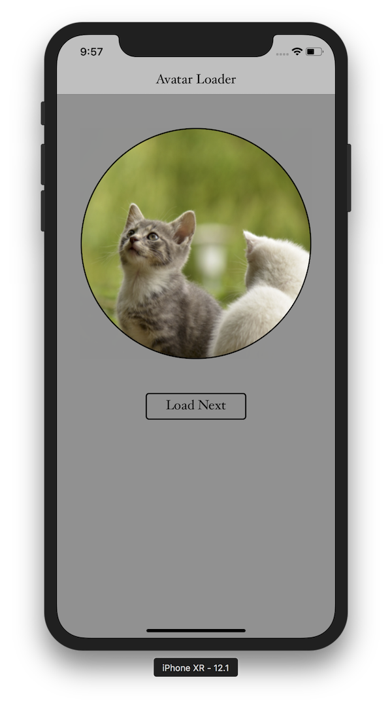

# Avatar Loader Challenge.

## Author:- Ankur Arya
email: <ankur.arya@me.com>

## Overview

This project implements an image loading functionality. This includes below elements.
- ViewController: For displaying a circular image (scaled to UIImageView size) view with a loader (with gradient stroke).
- CustomImageView: Reusable custom image view class that provides a circular loader.
- NetworkImageRepo: Repository for downloading images from urls. This also provides info about the data currently downloaded.
- ImageDownloader: Image Downloader from a given repository (passed as a dependency) with caching.
- DiskImageCache: It is a cache implementation based on LRU which uses document directory as the storage.

## Get Started

This project uses CocoaPods for dependency management. Please open the .xcworkspace in Xcode 10.0 or above. It should work right out of the box.
However, if you face any issue in building or running the project please run pod install command.

## Dependencies

  - This sample app require minimum iOS 12 and Xcode 10 to run.
  - This project also uses RxSwift which is added as a pod using CocoaPods.

## Screenshots

